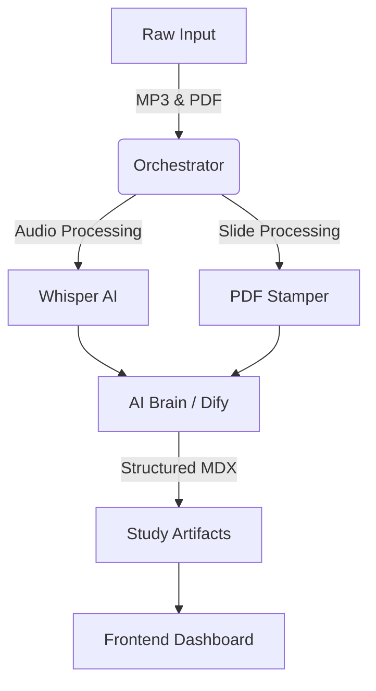

  
  <h1 style="margin-top: 0;">AnkiLM</h1>
  

> An automated "Import-to-Learn" pipeline that transforms raw lecture materials
> into structured, exam-ready study artifacts.

## 🚀 Overview

This project is a sophisticated study assistant designed to automate the grunt
work of university studies. Instead of manually transcribing lectures or
summarizing endless slide decks, this system ingests raw data (audio recordings
& PDFs) and uses an AI-powered pipeline to generate concise summaries, deep-dive
explanations, and spaced-repetition flashcards.

Information flows from raw files into a **local orchestration layer**, through
an **AI processing engine (Whisper & Dify)**, and finally renders into this
interactive **Frontend Dashboard** for review and study.

## ✨ Key Features

### 1. The "Import to Learn" Pipeline

- **Audio Ingestion**: Automatically detects and processes lecture recordings
  (MP3).
- **High-Fidelity Transcription**: Uses **OpenAI Whisper** to generate accurate
  text from speech.
- **Smart PDF Integration**: "stamps" slide decks with page numbers, allowing
  the AI to cite specific slides in its explanations.

### 2. AI-Powered Analysis (Dify Workflow)

The system feeds prepared data into a Dify workflow to produce structured
artifacts:

- **📄 Summaries**: Executive summaries of the lecture topics.
- **✨ Refined Transcripts**: Cleaned-up text, removing filler words and
  stuttering.
- **⚡ TL;DRs**: One-page cheat sheets with key exam topics.
- **📖 Concepts & Definitions**: Extracted terminology tables.
- **🧮 Example Problems**: Breakdown of practical examples mentioned in class.
- **🧠 Anki Cards**: Formatted flashcards ready for import into spaced
  repetition tools.

### 3. Interactive Frontend Dashboard

This repository hosts the modern web interface used to study the generated
content.

- **Tech Stack**: Built with **React 19**, **Vite**, **Tailwind CSS v4**, and
  **Framer Motion**.
- **MDX Integration**: Renders rich text content directly from the generated
  markdown files.
- **Responsive UI**: A clean, distraction-free reading environment.

## 🛠️ System Architecture

1. **Orchestrator**: A local script watches subject directories for new files.
2. **Processing**: Audio is transcribed; slides are indexed.
3. **Synthesis**: The Dify agent analyzes the content against the slides.
4. **Presentation**: This React application renders the final `01-summary.mdx`,
   `06-anki.mdx`, etc.

## 📸 Screenshots

  
  

  
  

## 💻 Tech Stack

**Frontend:**

- 
- 
- 
- **Framer Motion** (for smooth transitions)
- **MDX** (for content rendering)

**Pipeline / Backend:**

- Deno (Orchestrator)
- OpenAI Whisper (ASR)
- Dify (LLM Workflow Orchestration)

## 📝 Usage

- **Process New Content**: (Backend step) Drop files into the monitored data
  folder and run the orchestrator.
- **Study**: Open this dashboard. Navigate to the specific lecture to view the
  auto-generated summaries, definitions, and flashcards.

## 🔜 Future Improvements

- Real-time processing status updates in the dashboard.
- Direct PDF viewer integration alongside the transcript.
- Export to Notion integration.
